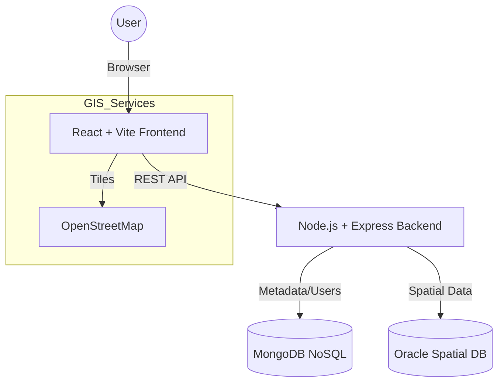

# Smart City Incident & Infrastructure Mapping System

A full-stack GIS web application utilizing a hybrid database architecture (MongoDB + Oracle Spatial) to manage and visualize city incidents.

## 🏗️ System Architecture



## 🚀 Data Flow
1. **Reporting**: User submits form -> Backend saves metadata to Mongo -> Backend saves Geometry to Oracle.
2. **Visualization**: Frontend requests map data -> Backend queries Oracle Spatial (efficient spatial filter) -> Returns GeoJSON.
3. **Analysis**: "Nearby" search uses Oracle `SDO_WITHIN_DISTANCE`.

## 🛠️ Tech Stack
- **Frontend**: React 18, Vite, Tailwind CSS, Leaflet (React-Leaflet).
- **Backend**: Node.js, Express.js, JWT Auth.
- **Database 1**: MongoDB (Mongoose) - User Profiles, Incident Details.
- **Database 2**: Oracle Database (node-oracledb) - Spatial Indexing & Querying (`SDO_GEOMETRY`).

## 📂 Project Structure
```
/
├── backend/
│   ├── config/         # DB Connections
│   ├── controllers/    # Request Handlers
│   ├── models/         # Mongoose Schemas
│   ├── routes/         # API Routes
│   ├── services/       # Oracle/Spatial Logic
│   ├── sql/            # Oracle Setup Scripts
│   ├── .env.example    # Env Vars
│   └── server.js       # Entry Point
├── frontend/
│   ├── src/
│   │   ├── components/ # Map, Navbar
│   │   ├── pages/      # Dashboard, Login, Report
│   │   ├── services/   # API Client
│   └── vite.config.js
└── README.md
```

## ⚙️ Setup Instructions

### Prerequisites
- Node.js (v14+)
- MongoDB (Running locally or Atlas)
- Oracle Database (18c/21c XE recommended) with Spatial features enabled.

### 1. Database Setup
**MongoDB**: Ensure it's running on port 27017 (or update .env).

**Oracle Spatial**:
1. Connect to your Oracle DB as a user with quota.
2. Run the script: `backend/sql/init_spatial.sql`
   - This creates the `INCIDENTS_SPATIAL` table.
   - Updates `USER_SDO_GEOM_METADATA`.
   - Creates the Spatial Index.

### 2. Backend Setup
```bash
cd backend
npm install
# Edit .env to match your Oracle Credentials
# npm start
```

### 3. Frontend Setup
```bash
cd frontend
npm install
npm run dev
```

### 4. Running the App
- Open `http://localhost:5173`.
- Register a new account.
- Go to "Report Incident", click on map, fill details.
- Go home to see the marker on the map.

## 📖 API Documentation

| Method | Endpoint | Description | Auth |
|--------|----------|-------------|------|
| POST | `/api/users` | Register User | No |
| POST | `/api/users/login` | Login User | No |
| POST | `/api/incidents` | Report Incident | Yes |
| GET | `/api/incidents/map` | Get GeoJSON | No |
| GET | `/api/incidents/nearby` | Find Nearby (lat, lng, radius) | No |

## 📊 Database Schemas

### MongoDB: `Incident`
```json
{
  "title": String,
  "description": String,
  "category": String,
  "location": { "latitude": Number, "longitude": Number },
  "postedBy": Link(User),
  "createdAt": Date
}
```

### Oracle: `INCIDENTS_SPATIAL`
| Column | Type | Description |
|--------|------|-------------|
| ID | NUMBER | PK |
| MONGO_ID | VARCHAR2 | Link to Mongo Document |
| LOCATION | SDO_GEOMETRY | Spatial Point (SRID 4326) |

---
*Created for MSc CS Project / Advanced GIS Systems*
# smart-city-gis
