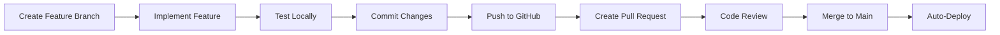

# Development Workflow - PIMS

This document outlines the complete development workflow, architecture decisions, and implementation details for the Public Incident Management System.

## Table of Contents
1. [System Architecture](#system-architecture)
2. [Development Workflow](#development-workflow)
3. [Database Schema](#database-schema)
4. [API Workflow](#api-workflow)
5. [Authentication Flow](#authentication-flow)
6. [Frontend State Management](#frontend-state-management)
7. [Deployment Workflow](#deployment-workflow)

## System Architecture

### High-Level Architecture
```
┌─────────────────┐
│   React SPA     │
│   (Frontend)    │
│   Port: 5173    │
└────────┬────────┘
         │ HTTP/REST
         │
┌────────▼────────┐
│  Express API    │
│   (Backend)     │
│   Port: 5000    │
└────────┬────────┘
         │ SQL
         │
┌────────▼────────┐
│ Oracle Database │
│   Port: 1521    │
└─────────────────┘
```

### Technology Stack Rationale

**Frontend: React + Vite**
- Fast development with HMR
- Modern build tooling
- Excellent TypeScript support (future migration)

**Backend: Express.js**
- Lightweight and flexible
- Large ecosystem
- Easy Oracle integration

**Database: Oracle**
- Enterprise-grade reliability
- Spatial data support (future GIS features)
- Free tier available (Oracle Cloud)

**Styling: Tailwind CSS**
- Utility-first approach
- Consistent design system
- Small production bundle

## Development Workflow

### 1. Feature Development Process



### 2. Local Development Setup

#### Initial Setup
```bash
# Clone repository
git clone https://github.com/shantanuuh/ADM.git
cd ADM

# Install root dependencies
npm install

# Setup backend
cd backend
npm install
cp .env.example .env
# Edit .env with your credentials

# Initialize database
node scripts/init_db.js
node scripts/init_admin.js

# Setup frontend
cd ../frontend
npm install
```

#### Daily Development
```bash
# Terminal 1: Backend
cd backend
npm run dev

# Terminal 2: Frontend
cd frontend
npm run dev

# Terminal 3: Database (if using Docker)
docker start oracle-xe
```

### 3. Git Workflow

#### Branch Naming Convention
- `feature/` - New features (e.g., `feature/photo-upload`)
- `fix/` - Bug fixes (e.g., `fix/login-validation`)
- `refactor/` - Code refactoring (e.g., `refactor/api-client`)
- `docs/` - Documentation updates (e.g., `docs/api-guide`)

#### Commit Message Format
```
<type>(<scope>): <subject>

<body>

<footer>
```

**Types:**
- `feat`: New feature
- `fix`: Bug fix
- `docs`: Documentation
- `style`: Formatting, missing semicolons, etc.
- `refactor`: Code restructuring
- `test`: Adding tests
- `chore`: Maintenance tasks

**Example:**
```
feat(map): add photo upload to incident reports

- Added file input to incident form
- Implemented image upload to cloud storage
- Display uploaded images in admin dashboard

Closes #123
```

## Database Schema

### Incidents Table
```sql
CREATE TABLE incidents (
    id NUMBER GENERATED ALWAYS AS IDENTITY PRIMARY KEY,
    title VARCHAR2(255) NOT NULL,
    description CLOB NOT NULL,
    type VARCHAR2(100) NOT NULL,
    latitude NUMBER(10, 7) NOT NULL,
    longitude NUMBER(10, 7) NOT NULL,
    status VARCHAR2(20) DEFAULT 'OPEN',
    created_at TIMESTAMP DEFAULT CURRENT_TIMESTAMP,
    updated_at TIMESTAMP DEFAULT CURRENT_TIMESTAMP
);
```

**Field Descriptions:**
- `id`: Auto-incrementing primary key
- `title`: Brief incident title (defaults to type)
- `description`: Detailed incident description
- `type`: Incident category (Road Accident, Fire, etc.)
- `latitude/longitude`: Geographic coordinates
- `status`: OPEN or RESOLVED
- `created_at/updated_at`: Timestamps

### Admins Table
```sql
CREATE TABLE admins (
    id NUMBER GENERATED ALWAYS AS IDENTITY PRIMARY KEY,
    username VARCHAR2(100) UNIQUE NOT NULL,
    password VARCHAR2(255) NOT NULL,
    created_at TIMESTAMP DEFAULT CURRENT_TIMESTAMP
);
```

**Field Descriptions:**
- `id`: Auto-incrementing primary key
- `username`: Unique admin username
- `password`: bcrypt hashed password
- `created_at`: Account creation timestamp

## API Workflow

### Incident Reporting Flow

```
User clicks map
    ↓
Frontend captures coordinates
    ↓
User fills form (type, description)
    ↓
POST /api/incidents
    ↓
Backend validates data
    ↓
Insert into Oracle DB
    ↓
Return success + incident ID
    ↓
Frontend shows success toast
    ↓
Frontend refreshes incident list
    ↓
New marker appears on map
```

### Admin Authentication Flow

```
Admin enters credentials
    ↓
POST /api/auth/login
    ↓
Backend verifies username
    ↓
bcrypt compares password
    ↓
Generate JWT token
    ↓
Return token to frontend
    ↓
Frontend stores in localStorage
    ↓
Include in Authorization header
    ↓
Backend verifies JWT on protected routes
```

## Authentication Flow

### JWT Token Structure
```json
{
  "header": {
    "alg": "HS256",
    "typ": "JWT"
  },
  "payload": {
    "id": 1,
    "username": "admin",
    "iat": 1234567890,
    "exp": 1234654290
  }
}
```

### Protected Route Middleware
```javascript
// authMiddleware.js
1. Extract token from Authorization header
2. Verify token signature with JWT_SECRET
3. Check token expiration
4. Attach user data to req.user
5. Call next() or return 401
```

## Frontend State Management

### Map Component State
```javascript
{
  incidents: FeatureCollection,    // All incidents (GeoJSON)
  selectedPosition: LatLng,        // User-selected location
  reportMode: boolean,             // Is user reporting?
  formData: {                      // Form state
    type: string,
    description: string
  },
  loading: boolean,                // Initial load
  submitting: boolean,             // Form submission
  formError: string,               // Error message
  showSuccess: boolean             // Success notification
}
```

### Admin Dashboard State
```javascript
{
  incidents: FeatureCollection,    // All incidents
  selectedIncident: Feature,       // Selected for details
  filter: 'ALL'|'OPEN'|'RESOLVED', // Status filter
  showList: boolean                // Mobile sidebar toggle
}
```

## Deployment Workflow

### Render.com Deployment

#### Automatic Deployment
```
Push to main branch
    ↓
GitHub webhook triggers Render
    ↓
Render pulls latest code
    ↓
npm run build (builds frontend)
    ↓
npm start (starts Express server)
    ↓
Express serves built frontend
    ↓
Application live at *.onrender.com
```

#### Environment Variables Setup
1. Navigate to Render dashboard
2. Select service
3. Go to Environment tab
4. Add variables:
   - `NODE_ENV=production`
   - `DB_USER=<oracle_user>`
   - `DB_PASSWORD=<oracle_password>`
   - `DB_CONNECT_STRING=<oracle_connection>`
   - `JWT_SECRET=<auto-generated>`
5. Save changes
6. Trigger manual deploy

### Database Initialization on Render

**Option 1: Render Shell**
```bash
# Access shell from Render dashboard
node backend/scripts/init_db.js
node backend/scripts/init_admin.js
```

**Option 2: Oracle Cloud SQL Developer**
```sql
-- Run schema.sql
-- Run admin_schema.sql
-- Manually insert admin user
```

## Testing Workflow

### Manual Testing Checklist

**Public Map:**
- [ ] Map loads centered on Maharashtra
- [ ] Can click to place marker
- [ ] Form appears at marker location
- [ ] All incident types available
- [ ] Form validation works
- [ ] Submit button shows loading state
- [ ] Success notification appears
- [ ] New incident appears on map
- [ ] Existing incidents display correctly
- [ ] Incident popups show details
- [ ] Locate Me button works
- [ ] Mobile responsive

**Admin Dashboard:**
- [ ] Login page loads
- [ ] Invalid credentials show error
- [ ] Valid credentials grant access
- [ ] Dashboard shows all incidents
- [ ] Can filter by status
- [ ] Can click incident on map
- [ ] Details panel shows
- [ ] Can resolve incident
- [ ] Can delete incident
- [ ] Logout works
- [ ] Protected routes redirect to login

### Future: Automated Testing

**Unit Tests (Jest)**
```javascript
// Example: incidentController.test.js
describe('Incident Controller', () => {
  test('creates incident with valid data', async () => {
    // Test implementation
  });
  
  test('rejects incident with missing fields', async () => {
    // Test implementation
  });
});
```

**Integration Tests (Supertest)**
```javascript
// Example: api.test.js
describe('POST /api/incidents', () => {
  test('returns 201 with valid data', async () => {
    // Test implementation
  });
});
```

**E2E Tests (Playwright)**
```javascript
// Example: incident-reporting.spec.js
test('user can report incident', async ({ page }) => {
  await page.goto('/');
  await page.click('.leaflet-container');
  // ... test steps
});
```

## Code Quality Standards

### ESLint Configuration
```json
{
  "extends": ["eslint:recommended", "plugin:react/recommended"],
  "rules": {
    "no-console": "warn",
    "no-unused-vars": "error"
  }
}
```

### Prettier Configuration
```json
{
  "semi": true,
  "singleQuote": true,
  "tabWidth": 2,
  "trailingComma": "es5"
}
```

## Performance Optimization

### Frontend
- Lazy load admin dashboard
- Memoize map markers
- Debounce form inputs
- Optimize images
- Code splitting

### Backend
- Database connection pooling
- Query optimization
- Response caching (future)
- Rate limiting (future)

### Database
- Index on latitude/longitude
- Index on status
- Regular ANALYZE TABLE

## Security Best Practices

### Frontend
- No sensitive data in localStorage
- HTTPS only in production
- Input sanitization
- XSS prevention

### Backend
- Parameterized queries
- JWT expiration
- Password hashing (bcrypt)
- CORS configuration
- Rate limiting (future)
- Input validation

### Database
- Least privilege principle
- Regular backups
- Encrypted connections

## Monitoring and Logging

### Application Logs
```javascript
// Structured logging
console.log({
  level: 'info',
  message: 'Incident created',
  incidentId: 123,
  timestamp: new Date().toISOString()
});
```

### Error Tracking (Future)
- Sentry integration
- Error boundaries in React
- API error logging

### Performance Monitoring (Future)
- Render metrics
- Database query performance
- Frontend Core Web Vitals

## Troubleshooting Guide

### Common Issues

**Database Connection Fails**
```bash
# Check Oracle is running
docker ps | grep oracle

# Check connection string
echo $DB_CONNECT_STRING

# Test connection
node -e "require('./backend/config/db').testConnection()"
```

**Frontend Can't Reach API**
```bash
# Check backend is running
curl http://localhost:5000/api/incidents

# Check CORS configuration
# Verify VITE_API_URL in frontend/.env
```

**Build Fails on Render**
```bash
# Check build logs
# Verify all dependencies in package.json
# Ensure Node version compatibility
```

## Future Enhancements

### Planned Features
- [ ] Photo upload for incidents
- [ ] Email notifications
- [ ] SMS alerts
- [ ] Advanced filtering
- [ ] Heatmap visualization
- [ ] Analytics dashboard
- [ ] Multi-language support
- [ ] Dark mode
- [ ] PWA capabilities
- [ ] Offline support

### Technical Debt
- [ ] Add TypeScript
- [ ] Implement automated testing
- [ ] Add error boundaries
- [ ] Improve accessibility
- [ ] Add API documentation (Swagger)
- [ ] Implement caching
- [ ] Add rate limiting
- [ ] Database migrations system

---

**Last Updated:** 2026-02-13
**Maintained By:** Shantanu
